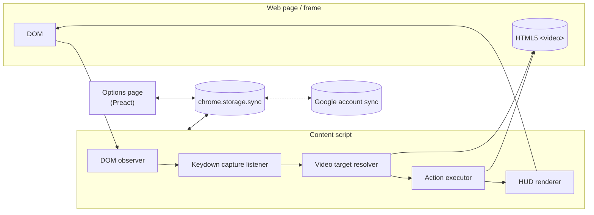

# Vidlever — Design Overview

> **Status**: Draft v1
> **Scope**: High-level design. Implementation details (function signatures, edge cases) are left for follow-up design docs.

## 1. Purpose & Vision

**Vidlever** is a Chrome extension that adds keyboard-driven, fully customizable playback control to every HTML5 video on the web. It treats keyboard shortcuts as a *lever* — a precise, intentional control mechanism that is always within reach — to manipulate playback speed, skip increments, fullscreen, play/pause, mute, Picture-in-Picture, and more.

### User persona

Power users who watch videos across many sites (YouTube, Udemy, Vimeo, news sites, lecture recordings, internal training platforms) and find each site's built-in shortcuts either inconsistent or insufficient. Concrete examples:

- Wants the same "skip back 10 seconds" shortcut on every site.
- Wants multiple skip granularities bound to different keys (10 s for fine seek, 30 s to skip intros).
- Wants finer speed steps (0.1×) than the typical 0.25× provided by sites.

### Central design bet

**Shortcut bindings should be data, not code.** Each binding is a tuple of `(action, parameters, key)` that the user can freely create, edit, duplicate, disable, or delete. This makes Vidlever a configuration UI on top of a small, fixed library of actions, rather than a hard-coded keymap.

## 2. Scope

### In scope (v1)

- Any web page that plays video via the HTML5 `<video>` element (effectively every modern video site).
- Chrome, Manifest V3.
- Local distribution as an **unpacked extension**. No Chrome Web Store submission.

### Out of scope (v1) — see §14

- Per-site enable/disable.
- Other Chromium browsers (Edge, Brave) — likely work without changes, but not officially supported.
- Firefox / Safari.
- DRM-protected streams that block JavaScript access to `<video>` (platform limitation, not Vidlever's).
- Chrome Web Store publication.
- Touch / gamepad input.

## 3. Functional Requirements

The following **action types** are supported. Each action type can be bound to any number of keys with different parameters; e.g., the user may keep two `skipForward` bindings with `seconds: 10` and `seconds: 30` simultaneously.

| Action | Parameter | Description |
|---|---|---|
| `playPause` | — | Toggle play / pause. |
| `skipForward` | `seconds: number` | Advance `currentTime` by N seconds. |
| `skipBackward` | `seconds: number` | Rewind `currentTime` by N seconds. |
| `speedDelta` | `delta: number` | Adjust `playbackRate` by `delta` (e.g., `+0.1`, `-0.1`). |
| `speedSet` | `rate: number` | Set `playbackRate` to an exact value (typically used for "reset to 1.0×"). |
| `muteToggle` | — | Toggle `muted`. |
| `fullscreenToggle` | — | Enter / exit fullscreen on the target video element. |
| `pipToggle` | — | Enter / exit Picture-in-Picture. |
| `seekToStart` | — | Jump to `currentTime = 0`. |
| `seekToEnd` | — | Jump to `currentTime = duration`. |
| `loopToggle` | — | Toggle the `loop` attribute. |

## 4. Activation Model

Vidlever is **always on** once installed. There is no popup toggle, no per-tab enable/disable, no whitelist.

**However**, the content script attaches its `keydown` capture listener **only when at least one `<video>` element is present in the current document or frame**. On pages without video, the extension is invisible and registers zero handlers. This is implemented by a `MutationObserver` rooted at `document.documentElement`; the listener is attached on the first video insertion and detached when no `<video>` remains.

Rationale:

- Requiring users to flip a toggle on every video they watch is high friction and forgetful.
- Side effects of overriding common keys (`Space`, arrow keys) are bounded to pages that actually have video.
- The opposite extreme — listening on every page regardless of video presence — would steal keys from search inputs and editors all over the web.

## 5. Video Targeting

When a shortcut fires, exactly one `<video>` must be selected as the operation target. Selection priority:

1. **Currently playing video** (`!video.paused && !video.ended`). If multiple, fall through to (2) restricted to the playing set.
2. **Largest rendered video** by `getBoundingClientRect()` area. Ties → (3).
3. **First video in DOM order** (`document.querySelectorAll('video')[0]`).

Rationale: "playing" matches user intent ("operate on what I'm watching"). Size is a strong fallback for paused-but-foreground videos. DOM order is the deterministic final tiebreaker.

### Cross-origin iframes

The content script is registered with `"all_frames": true` in the manifest, so it runs inside every frame, including cross-origin iframes (e.g., embedded YouTube players). Each frame independently observes its own videos, listens for `keydown` in that frame, and operates only on videos in that frame.

The parent frame cannot reach into a cross-origin iframe's `<video>` — this is a browser security boundary, not a Vidlever decision. As long as the user's focus is inside the iframe (e.g., they clicked into the embed), shortcuts route to the iframe's own content script and operate as expected.

## 6. Shortcut System

### 6.1 Binding data model

A **binding** is a single rule mapping a key combination to an action. Bindings live in an ordered list; the user can add, remove, reorder, duplicate, and disable individual entries.

```ts
type KeyCombo = {
  key: string;        // e.g., "ArrowRight", "Space", "f", "."
  shift?: boolean;
  ctrl?: boolean;
  alt?: boolean;
  meta?: boolean;     // Cmd on macOS, Win on Windows
};

type Binding = {
  id: string;             // uuid
  enabled: boolean;       // soft-disable without unbinding
  key: KeyCombo | null;   // null = unbound (entry preserved, inert)
} & (
  | { action: "playPause" }
  | { action: "skipForward";       params: { seconds: number } }
  | { action: "skipBackward";      params: { seconds: number } }
  | { action: "speedDelta";        params: { delta: number } }
  | { action: "speedSet";          params: { rate: number } }
  | { action: "muteToggle" }
  | { action: "fullscreenToggle" }
  | { action: "pipToggle" }
  | { action: "seekToStart" }
  | { action: "seekToEnd" }
  | { action: "loopToggle" }
);
```

Notes:

- `key: null` means the binding is **unbound** — it stays in the list (so the user can preserve a parameter for later) but never fires.
- `enabled: false` is a soft-disable that does not destroy the key assignment.
- **Duplicate keys are allowed.** When two enabled bindings share a key combo, the first match in list order wins. The user controls priority by reordering the list.

### 6.2 Default bindings (shipped on first install)

Vidlever ships with a minimal default set. The user is expected to extend it via the options page.

| Order | Action | Parameters | Default key |
|---|---|---|---|
| 1 | `playPause` | — | `Space` |
| 2 | `skipForward` | `seconds: 10` | `x` |
| 3 | `skipBackward` | `seconds: 10` | `z` |
| 4 | `fullscreenToggle` | — | `f` |
| 5 | `speedDelta` | `delta: +0.1` | `d` |
| 6 | `speedDelta` | `delta: -0.1` | `s` |
| 7 | `speedSet` | `rate: 1.0` | `r` |

Actions `muteToggle`, `pipToggle`, `seekToStart`, `seekToEnd`, and `loopToggle` are **available but unbound** by default. Users add them in the options page when needed.

### 6.3 Conflict policy

When a bound key is pressed, Vidlever overrides both site and browser defaults using a capture-phase listener:

```js
window.addEventListener("keydown", handler, { capture: true });
// inside handler:
event.preventDefault();
event.stopImmediatePropagation();
```

The capture-phase listener fires **before** site-installed listeners, and `stopImmediatePropagation` prevents both site listeners and any later Vidlever handlers in the chain from running.

**Exception — text-input focus.** When the active element matches any of:

- `<input>` (excluding `type` of `checkbox`, `radio`, `range`, `button`, `submit`)
- `<textarea>`
- `[contenteditable=""]` or `[contenteditable="true"]`
- Shadow-DOM descendants of any of the above

Vidlever **does nothing**: no override, no action, no `preventDefault`. This protects searches, comment forms, and rich-text editors on pages that also contain video.

### 6.4 Binding editing UX (options page)

Each binding row in the options page provides:

- A **key capture** field. Clicking it enters "listening" mode; the next keystroke becomes the new combo.
- A **Clear** button: sets `key: null` (unbound, retained).
- A **trash** icon: deletes the binding entirely.
- A **duplicate** icon: clones the binding with a fresh `id` (so the user can quickly add another `skipForward` with different `seconds`).
- A drag handle for reordering (priority on duplicate keys).
- An **enable / disable** toggle.

## 7. Speed Constraints

`HTMLMediaElement.playbackRate` accepts a wide numeric range, but extreme values cause audio dropouts or break playback on many sites.

| Constraint | Default | Configurable | Why |
|---|---|---|---|
| Minimum rate | `0.25` | yes | Below this, audio becomes unintelligible on most sites. |
| Maximum rate | `4.0` | yes | Chrome's practical stable upper bound. |
| Rounding | 2 decimal places | yes (1 or 2) | Prevents floating-point drift after repeated `+0.1` operations. |
| Boundary behavior | clamp (silent no-op) | no | Reaching the limit stops further change; no error UI. |

After every `speedDelta` / `speedSet` operation:

```ts
const next = Math.round((current + delta) * 10 ** decimals) / 10 ** decimals;
video.playbackRate = Math.min(Math.max(next, limits.min), limits.max);
```

## 8. HUD (Heads-Up Display)

### 8.1 Behavior

A small, semi-transparent overlay is rendered on top of the target video at all times when video is present on the page. It acts as both a **persistent state indicator** and a **transient feedback channel** for actions.

### 8.2 Visual specification

- **Position**: top-left of the video's bounding box, 16 px inset.
- **Size**: ~14 px font for the speed readout, ~12 px for icons. Pill-shaped background.
- **Opacity**: `0.4` resting; transitions to `0.9` while the pointer is over the video (`mouseenter` / `mouseleave`).
- **z-index**: `2147483647` (max signed 32-bit int) so it floats above any site overlay.
- **Fullscreen**: the HUD element is reparented into the fullscreen element on `fullscreenchange` so it stays visible.

### 8.3 Persistent content

Shown left-to-right, always when a video is on the page:

1. **Current playback rate** — always rendered, including `1.00×`. Formatted as `1.00x`, `1.50x`, `0.75x` (two decimals).
2. **Mute icon (`🔇`)** — only when `video.muted === true`.
3. **Loop icon (`🔁`)** — only when the loop binding has set `video.loop = true`.

### 8.4 Transient action overlay

When any action fires, a 1500 ms message **replaces the speed readout** (icons stay visible). After timeout, the readout returns to the current rate.

| Action | Overlay text |
|---|---|
| `playPause` (→ playing) | `▶ Play` |
| `playPause` (→ paused) | `⏸ Pause` |
| `skipForward` | `⏩ +Ns` (e.g., `+10s`) |
| `skipBackward` | `⏪ −Ns` |
| `speedDelta` | new rate replaces the readout; no separate overlay |
| `speedSet` | new rate replaces the readout; no separate overlay |
| `muteToggle` | `🔇 Muted` / `🔊 Unmuted` |
| `fullscreenToggle` | — (visual change is self-evident) |
| `pipToggle` | `PiP On` / `PiP Off` |
| `seekToStart` | `⏮ Start` |
| `seekToEnd` | `⏭ End` |
| `loopToggle` | `🔁 Loop On` / `Loop Off` |

If a second action fires while an overlay is showing, the new overlay replaces it and the 1500 ms timer resets.

### 8.5 Disable switch

A global `hud.enabled` boolean in settings (default `true`) hides the HUD entirely when set to `false`.

## 9. Settings & Storage

### 9.1 Storage backend

All settings live in `chrome.storage.sync`. This gives automatic cross-device sync for users signed into Chrome with sync enabled, and degrades gracefully (local-only) for users who are not signed in.

### 9.2 Storage schema (v1)

```ts
type StoredSettings = {
  version: 1;
  bindings: Binding[];
  speedLimits: {
    min: number;       // default 0.25
    max: number;       // default 4.0
    decimals: 1 | 2;   // default 2
  };
  hud: {
    enabled: boolean;          // default true
    opacityRest: number;       // default 0.4
    opacityHover: number;      // default 0.9
    overlayDurationMs: number; // default 1500
  };
};
```

Keys are namespaced under prefix `vl.`:

- `vl.version`
- `vl.bindings`
- `vl.speedLimits`
- `vl.hud`

### 9.3 Versioning & migration

The `version` field reserves capacity for schema evolution. On read, the content script and options page check `vl.version`:

- Missing → first install; write defaults.
- Equal to current → use as-is.
- Lower → run migration (none defined in v1; placeholder for v2+).

### 9.4 Stable Extension ID

Because Vidlever is distributed unpacked, its Extension ID must be **pinned** so that `chrome.storage.sync` correlates the same extension across machines. The ID is derived from the manifest's `key` field (a Base64-encoded RSA public key). With `key` set, the ID is identical on every machine. See §13 for key-generation steps.

### 9.5 Export / Import / Reset

The options page provides:

- **Export** — downloads `vidlever-settings.json` containing the full `StoredSettings` object.
- **Import** — file picker accepting the above JSON; validates against the schema before writing.
- **Reset to defaults** — confirmation dialog, then overwrites `vl.*` keys with shipped defaults.

## 10. Architecture

### 10.1 Components

- **Content script** (`src/content/`) — injected into every frame of every URL. Handles DOM observation, video targeting, key listening, action execution, HUD rendering, and storage reads.
- **Options page** (`src/options/`) — a Preact app served at `chrome-extension://<id>/options.html`. Reads and writes `chrome.storage.sync` directly.
- **`_locales/en/messages.json`** — UI strings. English is the only locale shipped in v1, but the `chrome.i18n` structure is in place to add others without a refactor.
- **No background service worker** in v1. Vidlever does not use `chrome.commands`, `chrome.contextMenus`, or cross-tab messaging.

### 10.2 Component diagram



### 10.3 Action execution sequence

```mermaid
sequenceDiagram
    actor U as User
    participant DOM
    participant CS as Content Script
    participant V as &lt;video&gt;
    participant HUD

    Note over CS: keydown capture listener is already attached<br/>(video detected in this frame)

    U->>DOM: presses x
    DOM->>CS: keydown event (capture phase)
    CS->>CS: active element is text input?
    Note right of CS: if yes → return without action
    CS->>CS: look up bindings list for x
    CS->>CS: pick binding skipForward(seconds: 10)
    CS->>CS: resolve target video<br/>(playing → largest → first)
    CS->>V: video.currentTime += 10
    CS->>HUD: show "⏩ +10s" for 1500ms
    CS->>DOM: preventDefault() + stopImmediatePropagation()
```

### 10.4 Manifest sketch

```json
{
  "manifest_version": 3,
  "name": "Vidlever",
  "version": "0.1.0",
  "description": "Keyboard-driven playback control for every HTML5 video.",
  "default_locale": "en",
  "key": "<BASE64_PUBLIC_KEY — see §13>",
  "permissions": ["storage"],
  "options_ui": {
    "page": "options.html",
    "open_in_tab": true
  },
  "icons": {
    "16":  "icons/icon16.png",
    "48":  "icons/icon48.png",
    "128": "icons/icon128.png"
  },
  "content_scripts": [
    {
      "matches": ["<all_urls>"],
      "all_frames": true,
      "run_at": "document_idle",
      "js": ["content.js"]
    }
  ]
}
```

No `host_permissions` is required because content scripts are statically declared and we do not perform cross-origin fetches.

## 11. Tech Stack

| Concern | Choice | Notes |
|---|---|---|
| Language | TypeScript (strict) | Discriminated unions on `Binding.action` are the main payoff. |
| Bundler | Vite + `vite-plugin-web-extension` | Handles MV3 manifest, HMR for content + options, file watching. |
| Options UI | Preact (~3 KB) | Reactive editing of the binding list; avoids React's bundle weight. |
| Content UI | Vanilla TS + DOM | HUD is one element with a handful of state updates; a framework would be overkill and increases site-collision risk. |
| Styling | Inline styles in content script; CSS Modules in options page | Inline avoids stylesheet bleed into host pages. |
| Package manager | pnpm | Faster installs and stricter dependency resolution than npm; content-addressable store keeps disk usage small across machines. |
| Lint / Format | Biome | Single tool for both; faster than ESLint + Prettier. |
| Tests | Vitest + happy-dom | Unit tests for resolver, executor, schema validator. |
| i18n | `chrome.i18n` + `_locales/en/messages.json` | English-only ship; structure ready for future locales. |

## 12. Directory Layout (proposed initial tree)

```
vidlever/
├── docs/
│   └── design/
│       └── overview.md           ← this document
├── public/
│   └── icons/
│       ├── icon16.png
│       ├── icon48.png
│       └── icon128.png
├── src/
│   ├── content/
│   │   ├── index.ts              ← entry; sets up observer, listener, HUD
│   │   ├── resolver.ts           ← video target selection
│   │   ├── executor.ts           ← action dispatch
│   │   ├── hud.ts                ← HUD render + transient overlays
│   │   ├── keymap.ts             ← keydown → binding match
│   │   └── focus.ts              ← text-input focus guard
│   ├── options/
│   │   ├── index.html
│   │   ├── main.tsx              ← Preact entry
│   │   ├── App.tsx
│   │   ├── components/
│   │   │   ├── BindingList.tsx
│   │   │   ├── BindingRow.tsx
│   │   │   ├── KeyCapture.tsx
│   │   │   ├── SpeedLimits.tsx
│   │   │   ├── HudSettings.tsx
│   │   │   └── ImportExport.tsx
│   │   └── styles.module.css
│   ├── shared/
│   │   ├── types.ts              ← Binding, KeyCombo, StoredSettings
│   │   ├── defaults.ts           ← default bindings, speed limits, hud
│   │   ├── storage.ts            ← typed wrapper over chrome.storage.sync
│   │   └── schema.ts             ← runtime validation for import
│   └── manifest.json
├── _locales/
│   └── en/
│       └── messages.json
├── tests/
│   ├── resolver.test.ts
│   ├── executor.test.ts
│   └── schema.test.ts
├── .gitignore                    ← must include *.pem
├── biome.json
├── package.json
├── tsconfig.json
├── vite.config.ts
└── README.md
```

## 13. Distribution & Operations

### 13.1 Distribution model

Vidlever is loaded as an **unpacked extension**:

1. `pnpm build` produces `dist/`.
2. Open `chrome://extensions/`, enable "Developer mode", click "Load unpacked", select `dist/`.
3. To update, rerun the build and click the reload icon on the extension card.

No Chrome Web Store submission is performed.

### 13.2 Stable Extension ID via `key`

For `chrome.storage.sync` to correlate the same extension across two physical machines, the Extension ID must be identical. The ID is derived from `manifest.json`'s `key` field. Without it, Chrome generates an ID from the install path, which differs per machine.

**One-time key generation:**

```bash
# Generate a 2048-bit RSA private key — KEEP THIS FILE PRIVATE.
openssl genrsa -out vidlever-key.pem 2048

# Derive the public key in the form Chrome's `key` field expects.
openssl rsa -in vidlever-key.pem -pubout -outform DER | openssl base64 -A
```

The Base64 output goes into `manifest.json`:

```json
{
  "manifest_version": 3,
  "name": "Vidlever",
  "key": "MIIBIjANBgkqhkiG9w0BAQEFAAOCAQ8AMIIBCgKCAQEA...",
  ...
}
```

### 13.3 Key management policy

- `vidlever-key.pem` is the **private key**. It must be listed in `.gitignore` and never committed.
- Back it up to a password manager (1Password, Bitwarden, etc.) or another encrypted store.
- To use Vidlever on a second machine while keeping the same Extension ID:
  - Clone the repo and copy `vidlever-key.pem` into the project (outside the build output).
  - The `key` field already committed in `manifest.json` is the **public** key, which is safe to share. The private key is never required for loading or running the extension — only for re-deriving the public key if the manifest entry is lost.
- If the `.pem` is lost: regenerate, accept a new Extension ID, and re-sync settings manually (export from the old install first if it is still loadable).

`.gitignore` excerpt:

```
*.pem
dist/
node_modules/
```

## 14. Out of Scope / Future Work

| Item | Notes |
|---|---|
| Per-site enable / disable | A popup with a "Disable on this site" toggle, storing a blocklist in `chrome.storage.sync`. Defer until v1 reveals concrete pain points. |
| `chrome.commands` integration | Reserves system-level shortcuts that work even when Chrome focus is not on the page. Limited to 4 commands per extension — unsuitable as the primary mechanism, but useful for 1–2 global ones (e.g., play/pause). |
| Additional locales | Add `_locales/ja/messages.json` etc.; UI is already wired through `chrome.i18n.getMessage`. |
| Site-specific adapters | Some players (Vimeo, certain DRM players) intercept native `<video>` controls. Could ship per-site bridges. |
| Touch / gamepad input | Out of scope — Vidlever is keyboard-first by design. |
| Audio-only `<audio>` | Out of scope — Vidlever is video-focused. |
| Web Store publication | Possible later if usage broadens beyond personal use. Would require icon assets, screenshots, privacy policy, and a re-pin of Extension ID via the Web Store-issued key. |
